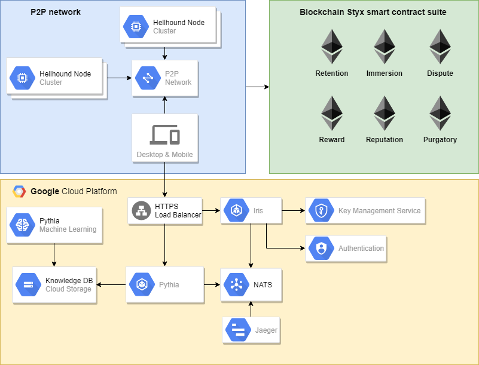

# Hellhound
HellHound is a **decentralized blind computation** platform.<br/

  

  

Blind computation is a process by which a function (or circuit) is successfully applied on encrypted inputs to provide the expected output. This output, depending on the use case, can be encrypted as well or it can be a plain text. 
It is called a “Blind” computation since no one, except the data provider, know the actual data being computed.
HellHound’s goal is to provide a truly decentralized computing environment and a set of cryptographic tools to enable dapps developers to implement privacy-by-design.
Cryptography has been around for a long time and is used in several industries to secure exchanges and protect data. It has however often been out of reach for developers with no computer science or mathematical background.
The reality is that not all developers need these scientific backgrounds to build their great applications or services. Unfortunately for their users, implementing security and privacy takes time and skills which most early stage startups don't have. We also believe that blockchain startups of today might be the big players of tomorrow's web 3.0.
We think that by making the developer’s tasks easier, more startups and companies will adopt best practices in terms of privacy and foster the emergence of self-sovereignty for their users. We also strongly believe that providing a blind and verifiable computation platform, without the need of having an omniscient third part in the process, will unlock a large pool of untapped opportunities.
We have a chance at rebuilding the internet, so as Richard Branson put it "let's not screw it, let's just do it".

## Papers

[Black Paper - Mission statement document](https://github.com/ConsenSys/hellhound/blob/master/hellhound-black-paper.pdf)

[Red Paper - Hellhound's formal specification](https://github.com/ConsenSys/hellhound/blob/master/hellhound-red-paper.pdf)

## Authors

**[Sajida Zouarhi - Co-Founder - Blockchain architect](https://www.linkedin.com/in/sajidazouarhi/)**

Sajida Zouarhi is an Engineer and worked as a Blockchain Architect @Consensys. She has been working on blockchain projects since 2015 and as a Computer Science researcher since 2014, moslty on transmission and computation of private data (key words: blind computation, complex systems, recommendation engine, SLAs, ontologies, telecommunication chains etc.).
She is also a technical advisor on the board of several Blockchain projects and has performed due-diligence for several startup investments. As the founder of the [Kidner Project](https://www.kidner-project.com) (social impact), she collaborated with WHO to help prevent Kidney Trafficking using Blockchain technology. She is an international Speaker, Hackathon Mentor and organizer of the Blockfest (hackathons & conferences) that she co-founded in 2016 in France.

**[Amira Bouguera - Co-Founder - Cryptographer](https://www.linkedin.com/in/amira-bouguera-282025a6/)**

Amira Bouguera is a Cryptographer, Mathematician and works as a cryptographer @Consensys. She has previously worked in the blockchain space prior to joining Consensys as a security engineer at Stratumn (traceability blockchain startup) and smart contract security auditor. Amira became interested in privacy and security related issues when she was studying cryptography. During that period, she worked in LJK applied math laboratory with one of the best international cryptographers on outsourced computation using Homomorphic encryption and Zero knowledge methods. She helped organizing the Grehack security conference and workshops. She is also an international speaker and gave talks about blockchain introduction, smart contracts security and cryptography during conferences (Dappcon) and meetups.

**[Abdelhamid Bakhta - Tech Lead and Full stack engineer](https://www.linkedin.com/in/abdelhamidbakhta/)** 

Abdelhamid is highly skilled, versatile and creative engineer with experience in e-banking and software development. Abdelhamid works daily with cloud infrastructure solution. 
He has excellent programming skills in several languages as well as a tech lead (management and business administration). He also has strong technical assets in security. Previously security officer of a fintech startup, he lead PCI certification compliance program for a Cloud Based Payment platform. Blockchain enthusiast, Abdelhamid is passionated by decentralization and actively followed the blockchain world since 5 years. Co-inventor of multiple patents, Abdelhamid has also a strong interest for ethical hacking.

## Components

- **Tanden** - virtual machine: https://github.com/ConsenSys/hellhound-vm
- **Styx** - smart contract suite:  https://consensys-hellhound.gitlab.io/styx/
- **Pythia** - recommendation engine: https://gitlab.com/consensys-hellhound/pythia
- **Cerberus** - light client: https://gitlab.com/consensys-hellhound/cerberus
- **Dashboard** - web UI: https://gitlab.com/consensys-hellhound/dashboard

## Proof of concept

# HellHound - Demo v0.1 presented at DevCon 4

**Video**

### Introduction

The Hellhound platform is divided in multiple components and designed as a microservices architecture. First of all, hellhound components are splitted in two major categories : **on-chain** and **off-chain**.

The **on-chain** category includes all components related and running directly into the blockchain. The backing blockchain used is Ethereum thanks to the capability of building turing complete programs. It allow us to develop smart contracts to handle some critical parts of the system. Basically on-chain smart contracts are used when we need transparency or the immutability, intrinsic characteristics of the blockchain. We also use smart contracts to register *computation proofs*.

The **off-chain** category is designed as a Software As A Service platform including multiple microservices. This platform was designed to be scalable and highly available.

We use Kubernetes as the orchestrator of deployments. Kubernetes is defined as a Production-Grade Container Orchestration and it is a system for automating deployment, scaling, and management of containerized applications.

In order to have a highly available environment for the DevCon event, we have set up a Kubernetes cluster on top of Google Kubernetes Engine platform.

The proof of concept was implemented to follow best practices and guidelines about microservices architecture. The main objective is to show team skills and to prove our capability to build a scalable and robust platform. We aim to target millions of users, that is why we have set such an architecture.

#### Architecture overview

#### Demo story

The purpose of the demo is to show how to use a decentralized blind computation platform to execute a service for the end user. We will describe the use case and the related story that were presented during DevCon4 (2018).

Some of the components were mocked or simplified for demonstration. For example instead of having a true decentralized peer to peer protocol between nodes, a centralized message broker is used to handle events and communication.

The message broker used for the Demo is NATS. The core principles underlying NATS are performance, scalability, and ease-of-use.

Here are the components implemented in the Demo PoC :

-   **Pythia** : Simplified recommendation engine

-   **Iris** : Authentication service

-   **Immersion & Retention** : Authentication Smart Contracts

-   **10 cerberus nodes** : 8 are honest and 2 are **malicious** nodes

-   **Light cerberus** : UI/UX to interact with the platform

**Pythia**'s role is to recommend the best cryptosystem to the user for a specific computation. The scope of the Demo was reduced to only one cryptosystem : Paillier. Paillier is a **homomorphic encryption scheme** where you can perform the following operations on encrypted data :

-   *Add* 2 ciphers

-   *Add* 1 cipher and 1 constant

-   *Multiply* 1 cipher by 1 constant

The user is the only entity that can decrypt the result and retrieve it exactly as it was performed on plain data. It shows the magical power of homomorphic encryption through a simple use case.

**Iris** role is to perform an off chain authentication using one classical authentication provider and OAuth protocol to generate a token that can therefore be used to authenticate to the blockchain using the offchain whitelist mechanism. In the Demo the user can authenticate using her Gitlab account.

In order to use the service, the user need to perform the staking operation. We wanted to show that Hellhound can interact with other blockchain related services like Shipl (ex-Fuel). [Shipl](https://shipl.co/) enables meta transaction and can be considered as a gas provider for the end user. It allows to do the staking mechanism with a simple debit card payment using **Stripe API**. This is an easy to motivate people to enter the blockchain ecosystem without having deep knowledge or understanding of crypto technology.

Once authenticated to the blockchain, a smart contract call generates the authentication token, then the end user can define the computation she wants to execute on the Hellhound platform. This operation consists in uploading a Hellhound byte code script that combines the 3 Paillier operations.

We perform the encryption on the client side prior to sending data to the message broker.

Then we have the selection process that will randomly choose the desired number of nodes to perform the computation. Since it is not multi party computation, we offer the possibility to select multiple nodes for the computation. We can at the end of the computation perform a basic consensus algorithm to detect if some nodes are malicious.

In the demo, 2 nodes are malicious and always give false results for any computation. The demo shows that we can easily detect them if they are selected because they will provide different results that the ones of honest nodes (you see it in the hashes). So if the end user choose 5 nodes for the computation, the selection algorithm will select at least 3 honest nodes.

We have intentionally slowed down the Virtual Machine instruction execution to have a graphical representation of the overall computation that can be understood by a human. The end user is able to see the live status of the computation because each individual instruction execution is traced in the system using the message broker.

Once the computation is done, the light client perform the decryption of the result and retrieve the plain output. *Magic.*

## Ubiquitous language

Ubiquitous Language is the term Eric Evans uses in **Domain Driven Design** for the practice of building up a common, rigorous language between developers and users. This language should be based on the Domain Model used in the software - hence the need for it to be rigorous, since software doesn't cope well with ambiguity and neither do humans.

### Glossary

#### Kokoro - Soul

Kokoro means "heart; mind; mentality; emotions; feelings". In HellHound context, Kokoro is assimilated to the soul of users. User private data are part of the Kokoro.

#### Ki - Computation

Ki is believed to be vital force forming part of any living entity. K*i* translates as "air" and figuratively as "material energy", "life force", or "energy flow".In Hellhound context, the Ki denotes the computations running on HellHound network. Basically, the term Ki stands for the program interpreted and executed by the Tanden (HellHound  Virtual Machine).

#### Kokyu - Computation byte code

Kokyu can be assimilated to the Ki. Kokyu literally means “breath”. In HellHound context, Kokyu denotes the raw byte code that composed the Ki.

#### Tanden - HellHound Virtual Machine

The Tanden (or lower Dantian), as conceptualised by the Chinese and Japanese martial arts, is important for their practice, because it is seen, as the term "Sea of Qi" indicates, as the reservoir of vital or source energy (Ki). It is considered as the oven of the body. Ki is considered as fire. The Tanden is used to burn the Ki. This is why in HellHound context,Tanden denotes the HellHound Virtual Machine running on nodes.

#### Hanko - Hash fingerprint

In Japan, seals in general are referred to as Hanko. In HellHound context, Hanko denotes cryptographic hash of HellHound objects. For example the Hanko of the Tanden is the Keccak-256 hash of the concatenation of register set values and keystore keys. The Hanko of the Ki is the Keccack-256 hash of the Kokyu bytes.

## Escape game at DevCon 4

**The first Crypto Escape Room opened its door at DEVCON 4 in Prague.** The purpose of the game was to educate the audience about cryptography in an interactive and fun way and introduce them to HellHound universe.

We created a universe around HellHound to make the complexity of our technology less threatening and more playful.

Each technical component of HellHound is a character of the HellHound universe and was especially designed for it. We used this universe to tell stories about data privacy and to create experiences in the escape game we organized at Devcon4.

Find out more here:

[HELLHOUND ESCAPE GAME - A CRYPTO ADVENTURE (1/2)](https://medium.com/@hellhound_eth/hellhound-escape-game-ed7b0f9c9f02)

[HELLHOUND ESCAPE GAME - A CRYPTO ADVENTURE (2/2)](https://medium.com/@hellhound_eth/hellhound-escape-game-814b4ac600c0)

